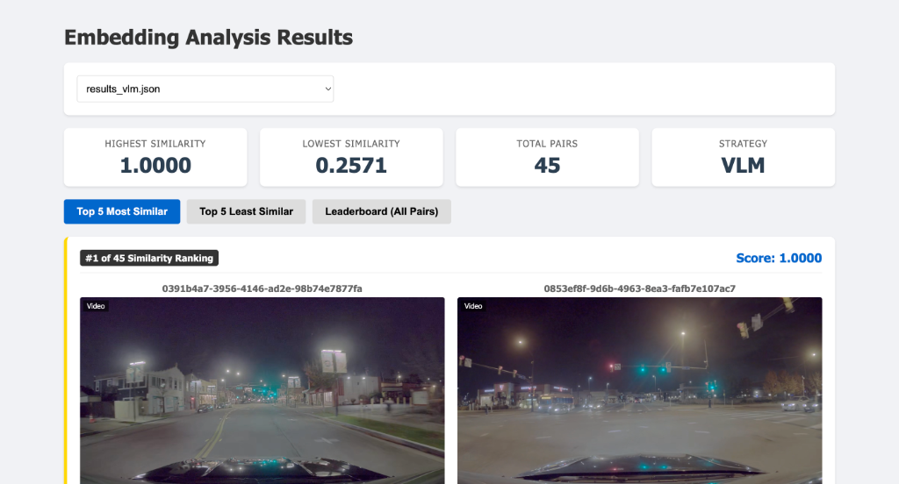

# NVIDIA Dataset Embedding Analysis Demo

This project explores various **embedding strategies** for analyzing autonomous driving data (NVIDIA text-to-driving dataset). It compares different methods of extracting semantic and visual information from video frames to find similar driving scenes.

## Features

- **7 Embedding Strategies:**
    1.  **Naive (SigLIP):** Encodes the entire image directly.
    2.  **Foreground Strict:** High-confidence YOLO foreground segmentation (isolates obvious objects).
    3.  **Foreground Loose:** Low-confidence segmentation with dilation (includes context).
    4.  **Text (Spatial):** Template-based description ("Cars on left, Pedestrian in center").
    5.  **VLM (BLIP):** Generates a natural language caption for the entire scene.
    6.  **Video (X-CLIP):** Embeds the full video clip by processing 8 temporal frames.
    7.  **Object Semantics:** "Bag of Objects" approach – detects objects, individually captions them, and aggregates into a detailed text description.

- **Browser-Based Viewer:**
    - Visualizes similarity search results.
    - Shows "Debug Inputs" (what the model actually saw: masked images, heatmaps, text).
    - Side-by-side video comparison.

## Installation

```bash
cd scripts

pip install torch transformers sentence-transformers ultralytics flask opencv-python scikit-learn matplotlib
```

## Usage

### 1. Generate Embeddings & Run Analysis

Run the analysis script to process data and generate results for a specific strategy:

```bash
cd scripts
python3 run_embedding_test.py --strategy [STRATEGY_NAME] --limit 10
```

**Available Strategies:**
- `naive`
- `foreground_strict`
- `foreground_loose`
- `text`
- `vlm`
- `video`
- `object_semantics`

### 2. Launch the Viewer

Start the Flask app to view results in your browser:

```bash
cd scripts
python3 viewer_app.py
```

Open **http://localhost:8080** in your browser.


## Viewer Interface

The browser-based viewer (`viewer_app.py`) provides a rich interface for interacting with the analysis results.



### Key Features:
1.  **Strategy Selection:**  The dropdown menu allows you to switch between different `results_*.json` files (e.g., VLM, Object Semantics, Naive) instantly.
2.  **Statistics Bar:** Displays the highest/lowest similarity scores and total pairs analyzed for the current strategy.
3.  **Similarity Ranking:**
    *   **Top 5 Most Similar:** Shows pairs with high cosine similarity (visually or semantically close).
    *   **Top 5 Least Similar:** Shows pairs that are distinct.
    *   **Leaderboard:** A sortable table of all pairs.
4.  **Debug Inputs:**
    *   Clicking on a pair opens a **Detail Modal**.
    *   This shows the **Side-by-Side Videos** (autoplay).
    *   **Debug Image/Text:** Shows exactly what the model "saw".
        *   *Naive:* Original Image.
        *   *Foreground:* Masked Foreground (black background).
        *   *VLM/Text:* Text Overlay of the generated caption.
        *   *Video:* Filmstrip of sampled frames.
        *   *Object Semantics:* Detailed object inventory list.

## Directory Structure

- `extracted_data/`: Dataset images and videos.
- `scripts/`: Source code.
    - `embeddings/`: Strategy implementations (`strategies.py`).
    - `analysis_results/`: Generated JSON results and debug images.
    - `templates/`: HTML frontend for the viewer.
