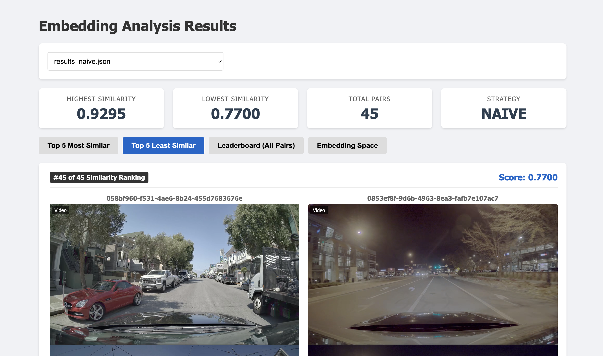

# NVIDIA Dataset Embedding Analysis Demo

This project explores various **embedding strategies** for analyzing autonomous driving data (NVIDIA text-to-driving dataset). It compares different methods of extracting semantic and visual information from video frames to find similar driving scenes.

## Features

- **7 Embedding Strategies:**
    1.  **Naive (SigLIP):** Encodes the entire image directly.
    2.  **Foreground Strict:** High-confidence YOLO foreground segmentation (isolates obvious objects).
    3.  **Foreground Loose:** Low-confidence segmentation with dilation (includes context).
    4.  **Text (Spatial):** Template-based description ("Cars on left, Pedestrian in center").
    5.  **VLM (BLIP):** Generates a natural language caption for the entire scene.
    6.  **Video (X-CLIP):** Embeds the full video clip by processing 8 temporal frames.
    7.  **Object Semantics:** "Bag of Objects" approach – detects objects, individually captions them, and aggregates into a detailed text description.
    8.  **ViT Attention:** Use ViT attention weights to mask image (e.g. threshold at 0.35) for a vision embedding. This currently implements FASTViT, but can be extended to any ViT model.
    9.  **VLM Description:** Uses a lightweight VLM to generate a description of the scene in a given image.
    10. **VLM Hazard:** Uses a lightweight VLM to generate a focused description on the hazards and uncertainties of the scene in a given image.
    11. **OpenRouter Description:** Uses external VLMs (via OpenRouter) to describe the scene (ex. `nvidia/nemotron-nano-12b-v2-vl:free`).
    12. **OpenRouter Hazard:** Uses external VLMs (via OpenRouter) to focus on hazards and safety-critical events (ex. `nvidia/nemotron-nano-12b-v2-vl:free`).
    13. **OpenRouter Storyboard:** Samples 4 frames from the video, creates a 2x2 grid, and analyzes the sequence for temporal understanding using an external VLM (ex. `nvidia/nemotron-nano-12b-v2-vl:free`).


- **Browser-Based Viewer:**
    - Visualizes similarity search results.
    - Shows "Debug Inputs" (what the model actually saw: masked images, heatmaps, text).
    - Side-by-side video comparison.
  


## Installation

```bash
cd scripts

pip install torch transformers sentence-transformers ultralytics flask opencv-python scikit-learn matplotlib pandas umap-learn
```

Download a subset of the PhysicalAI Autonomous Vehicles dataset
```
mkdir -p nvidia_dataset_demo && wget "https://huggingface.co/datasets/nvidia/PhysicalAI-Autonomous-Vehicles/resolve/main/camera/camera_front_wide_120fov/camera_front_wide_120fov.chunk_0000.zip" -O nvidia_dataset_demo/dataset.zip
unzip -q nvidia_dataset_demo/camera/camera_front_wide_120fov/camera_front_wide_120fov.chunk_0000.zip -d
```
This should create a folder in `nvidia_dataset_demo/extracted_data`.

## Configuration

To use the **OpenRouter** strategies (and access external VLMs like GPT-4o, Claude 3.5, or NVIDIA Nemotron), you must set up your API key.

1.  Create a `.env` file in the project root:
    ```bash
    touch .env
    ```
2.  Add your OpenRouter API key and Model Name:
    ```bash
    OPENROUTER_API_KEY=sk-or-v1-...
    OPENROUTER_MODEL=nvidia/nemotron-nano-12b-v2-vl:free # default
    ```
    > **Note:** These strategies communicate with the [OpenRouter API](https://openrouter.ai). You can use any model available on OpenRouter by changing the `OPENROUTER_MODEL` variable (e.g. `openai/gpt-4o`, `anthropic/claude-3.5-sonnet:beta`, etc.).

## Usage


### 1. Generate Embeddings & Run Analysis

Run the analysis script to process data, generate results, and calculate multi-dimensional projections (PCA, t-SNE, UMAP) for visualization:

```bash
cd scripts
python3 run_embedding_test.py --strategy [STRATEGY_NAME] --limit 10
```

**Output:**
*   `analysis_results/results_[strategy].json` (Contains rankings & 2D coordinates for viewer)
*   `analysis_results/projections_[strategy].csv` (Contains 5D coordinates for external analysis)

**Available Strategies:**
- `naive`
- `foreground_strict`
- `foreground_loose`
- `text`
- `vlm`
- `video`
- `object_semantics`
- `fastvit_attention`
- `fastvlm_description`
- `fastvlm_hazard`
- `openrouter_description`
- `openrouter_hazard`
- `openrouter_storyboard`


### 2. Launch the Viewer

Start the Flask app to view results in your browser:

```bash
cd scripts
python3 viewer_app.py
```

Open **http://localhost:8080** in your browser.


## Viewer Interface

The browser-based viewer (`viewer_app.py`) provides a rich interface for interacting with the analysis results.

### Key Features:
1.  **Strategy Selection:**  The dropdown menu allows you to switch between different `results_*.json` files (e.g., VLM, Object Semantics, Naive) instantly.
2.  **Statistics Bar:** Displays the highest/lowest similarity scores and total pairs analyzed for the current strategy.
3.  **Similarity Ranking:**
    *   **Top 5 Most Similar:** Shows pairs with high cosine similarity (visually or semantically close).
    *   **Top 5 Least Similar:** Shows pairs that are distinct.
    *   **Leaderboard:** A sortable table of all pairs.
    *   **Embedding Space:** Interactive scatter plot of all samples.
        *   Switch between **t-SNE**, **UMAP**, and **PCA** projections.
        *   Click comments to see the corresponding video and debug view.
4.  **Debug Inputs:**
    *   Clicking on a pair opens a **Detail Modal**.
    *   This shows the **Side-by-Side Videos** (autoplay).
    *   **Debug Image/Text:** Shows exactly what the model "saw".
        *   *Naive:* Original Image.
        *   *Foreground:* Masked Foreground (black background).
        *   *VLM/Text:* Text Overlay of the generated caption.
        *   *Video:* Filmstrip of sampled frames.
        *   *Object Semantics:* Detailed object inventory list.
        *   *ViT Attention:* Mask image based on attention weights.
        *   *VLM Description:* Embedding of VLM-generated scene description.

        *   *VLM Hazard:* Embedding of VLM-generated hazards/uncertainties description.
        *   *OpenRouter Strategies:* Text description returned by the API.
        *   *Storyboard:* 2x2 grid image of sampled frames used for temporal analysis.


## Directory Structure

- `extracted_data/`: Dataset images and videos.
- `scripts/`: Source code.
    - `embeddings/`: Strategy implementations (`strategies.py`).
    - `analysis_results/`: Generated JSON results and debug images.
    - `templates/`: HTML frontend for the viewer.
